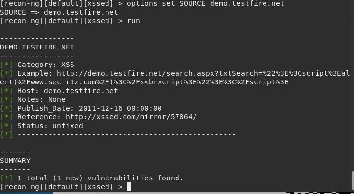
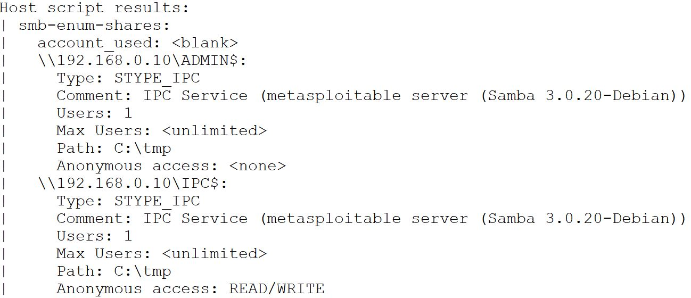

## Week 16 Homework Submission File: Penetration Testing 1

#### Step 1: Google Dorking

- Using Google, can you identify who the Chief Executive Officer of Altoro Mutual is:
Karl Fitzgerald

- How can this information be helpful to an attacker:
An attacker can use this information to create a phishing campaign to attack the Chief Executive Officer (CEO) and get that CEO  to download a hacked payload to give an attacker an inroad to the Altoro Mutual network or access to confidential information.

#### Step 2: DNS and Domain Discovery

Enter the IP address for `demo.testfire.net` into Domain Dossier and answer the following questions based on the results:

  1. Where is the company located: 
San Antonio, TX US

  2. What is the NetRange IP address:
65.61.137.64 to 65.61.137.127

  3. What is the company they use to store their infrastructure:
Rackspace Backbone Engineering

  4. What is the IP address of the DNS server:
65.61.137.117

#### Step 3: Shodan

- What open ports and running services did Shodan find:
Port: 80, service: Apache Tomcat/Coyote JSP Engine, HTTP
Port: 443, service: Apache Tomcat/Coyote JSP Engine, HTTPS
Port: 8080, service: Apache Tomcat/Coyote JSP Engine, HTTP

#### Step 4: Recon-ng

- Install the Recon module `xssed`.
recon-ng
marketplace install xssed
modules load recon/hosts-ports/shodan_ip
keys add shodan_api [paste-api-key-here]
keys list
- Set the source to `demo.testfire.net`. 
modules load xssed
options set SOURCE demo.testfire.net
- Run the module.
run

Is Altoro Mutual vulnerable to XSS: 
Yes. because the status is unfixed

### Step 5: Zenmap

Your client has asked that you help identify any vulnerabilities with their file-sharing server. Using the Metasploitable machine to act as your client's server, complete the following:

- Command for Zenmap to run a service scan against the Metasploitable machine: 
zenmap
target=192.168.0.10
Profile=Regular Scan
Command=nmap 192.168.0.10

- Bonus command to output results into a new text file named `zenmapscan.txt`:
Command=nmap -T4 -oN 192.168.0.10

- Zenmap vulnerability script command: 
Command=nmap -T4 --script smb-enum-shares.nse 192.168.0.10

- Once you have identified this vulnerability, answer the following questions for your client:
  1. What is the vulnerability:
The metasploitable server is presently allowing anonymous access to READ and WRITE to the directory at PATH C:\tmp in the share called \\192.168.0.10\IPC$

  2. Why is it dangerous:
By allowing any number of anonymous users to have WRITE access, any of those users may write a malicious file to that shared folder, then the malicious file could be used to exploit any vulnerabilities of the machine or operating system or application software.

  3. What mitigation strategies can you recommendations for the client to protect their server:
I recommend that anonymous WRITE access be disabled on a share.
I recommend using a filewall and access control lists to limit access of the server to authorized users only.
I recommend installing IDS to monitor the server.
I recommend running backups of filesystem to protect against loss of data.
I recommend taking  snapshots of the operating system.
I recommend running antivirus scans and vulnerability analysis periodically on the server to prevent loss of integrity, confidentiality and loss of availability.

get screen shot of the suggestions for exploiting vulnerabilities.

---
© 2020 Trilogy Education Services, a 2U, Inc. brand. All Rights Reserved.  

